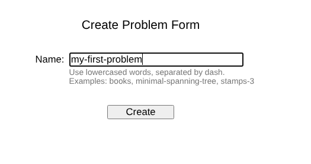
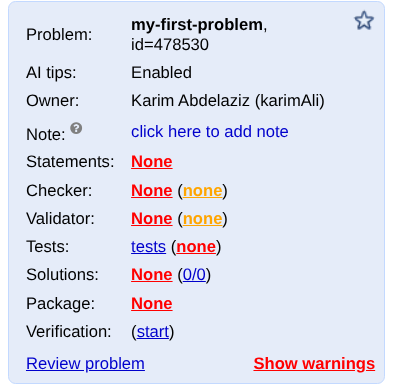
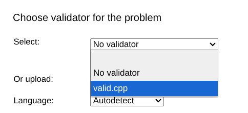
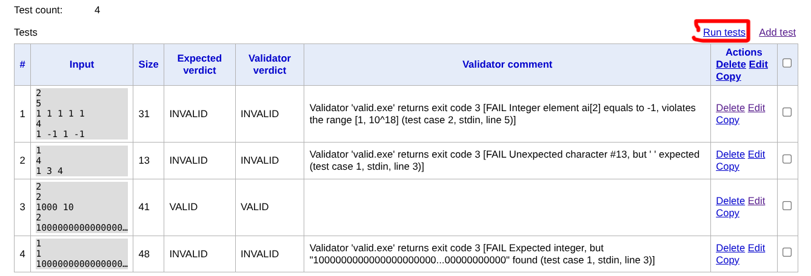
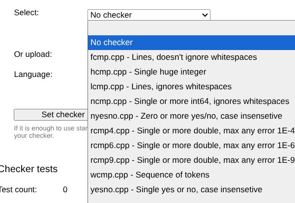
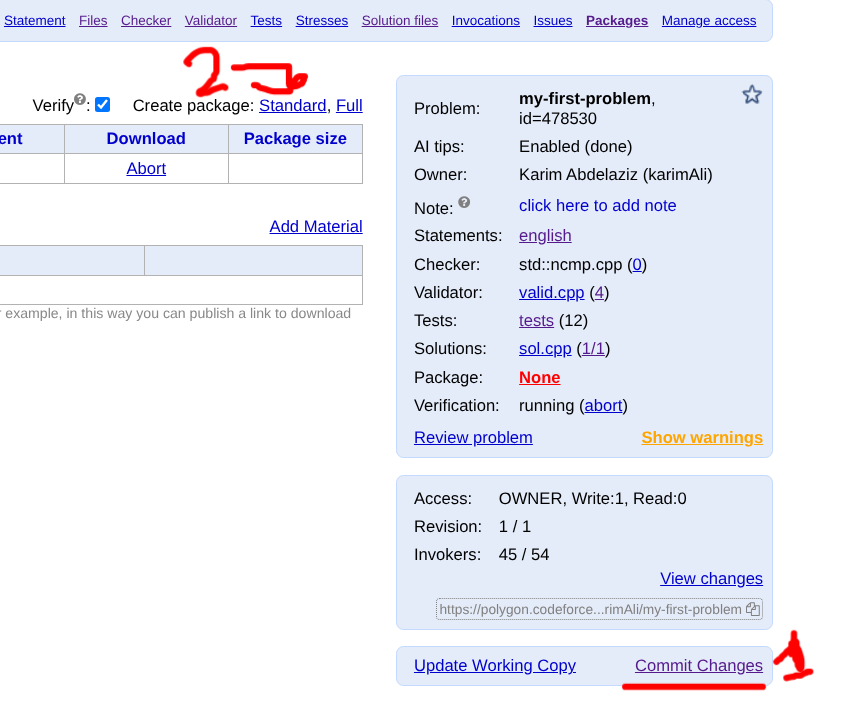
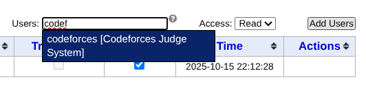

# 🧩 How to Create Your First Problem on Polygon

This guide walks you through the **step-by-step process** of creating your first programming problem using [Polygon](https://polygon.codeforces.com/).

These resources together provide everything you need to create professional-quality competitive programming problems on Polygon using **Testlib**.
# Polygon Tutorials and Articles

## 🎥 YouTube Tutorials

1. **Polygon Full Walkthrough – Kareem Khaled**
   ▶️ [Watch on YouTube](https://youtu.be/xqkIZfWuTpY?si=2qQNwAel1q99_ChX)

2. **Polygon Step-by-Step Explanation**
   ▶️ [Watch on YouTube](https://youtu.be/ue2Qk494ylw?si=d2F4ksy9RDwpHn_Z)

---

## 📝 Recommended Article

**Polygon Codeforces Tutorial by Quang Loc**
A detailed and beginner-friendly written guide explaining how to use Polygon effectively for problem preparation.

🔗 [Read the Article](https://quangloc99.github.io/posts/polygon-codeforces-tutorial/)


## 🧠 Step 1: Come Up with a Problem Idea

Before starting, you need a **problem idea**.
Let’s take a simple example problem:

> **Problem Example:**
> Given an array of size n find the first index of perfect square element in the array

---

## 🏧 Step 2: Create a New Problem in Polygon

1. Open [Polygon](https://polygon.codeforces.com/).
2. Click **“New Problem”**.
3. Enter your **problem name** (note: this is an internal name and won’t appear in the statement).



Now you’ll see the problem structure:



---

## 📜 Step 3: Write the Problem Statement

Polygon uses **LaTeX** for problem statements.
Here are useful references:

* [Polygon LaTeX Guide](https://polygon.codeforces.com/docs/statements-tex-manual)
* [Overleaf Documentation](https://www.overleaf.com/learn)

### Example LaTeX Statement

```latex
Karim is preparing a small example problem for Polygon.  
Given an array of integers, your task is to find the index of the first element that is a perfect square.  

\InputFile
The first line contains a single integer $t$ ($1 \le t \le 10^4$) — the number of test cases.

Each test case consists of two lines:
\begin{itemize}
\item The first line contains an integer $n$ ($1 \le n \le 10^{6}$) — the size of the array.
\item The second line contains $n$ integers $a_1, a_2, \dots, a_n$ ($1 \le a_i \le 10^{9}$).
\end{itemize}

It is guaranteed that the total sum of all $n$ over all test cases does not exceed $10^{6}$.

\OutputFile
For each test case, print a single integer — the 1-based index of the first perfect square element in the array, or \(-1\) if none exists.
```

✅ **Tips:**

* Always include all constraints and input/output formats clearly.
* Mention all edge cases if relevant.

---

## ✅ Step 4: Create the Validator

The **validator** checks that all test cases generated for the problem satisfy the constraints.

For example, if your problem says the array is increasing, the validator must ensure that the generated array is actually increasing.

In our example, we just need to check that all constraints are satisfied:

```
1 ≤ t ≤ 10^4  
1 ≤ n ≤ 10^6  
1 ≤ a_i ≤ 10^18  
Sum of n over all test cases ≤ 10^6
```

### Example Validator (C++)

```cpp
#define _CRT_SECURE_NO_WARNINGS
#include "testlib.h"
#include <bits/stdc++.h>
using namespace std;

const int TEST_COUNT_MIN = 1;
const int TEST_COUNT_MAX = 10000;
const int MIN_N = 1;
const int MAX_N = 1000000;
const int SUM_N = 1000000;
const long long MIN_AI = 1;
const long long MAX_AI = 1000000000;

int main(int argc, char** argv) {
    registerValidation(argc, argv);
    int t = inf.readInt(TEST_COUNT_MIN, TEST_COUNT_MAX, "t");
    inf.readEoln();

    long long total_n = 0;
    for (int i = 0; i < t; i++) {
        setTestCase(i + 1);
        int n = inf.readInt(MIN_N, MAX_N, "n");
        inf.readEoln();
        total_n += n;
        inf.readLongs(n, MIN_AI, MAX_AI, "a_i");
        inf.readEoln();
    }

    ensuref(total_n <= SUM_N, "Sum of n over all test cases must not exceed 1e6");
    inf.readEof();
}
```

Upload it in the **Validator** section.


---

##  Step 5: Test the Validator

You can test your validator using sample invalid and valid inputs.

Example tests:

```text
2
5
1 1 1 1 1
4
1 -1 1 -1
===
1
4
1 3 4
===
2
2
1000 10
2
1000000000000000000 2
===
1
1
1000000000000000000000000000000000000000
```



---

## 💻 Step 6: Add Solutions

You must provide at least one **correct solution**.
It’s also recommended to add:

* **Slow (TLE)** solutions
* **Wrong** solutions (for testing the checker)

### Example Solution

```cpp
#include <bits/stdc++.h>
using namespace std;

void solve() {
    int n;
    cin >> n;
    vector<long long> a(n);
    for (auto &x : a) cin >> x;

    for (int i = 0; i < n; i++) {
        long long sq = sqrtl(a[i]);
        if (sq * sq == a[i]) {
            cout << i + 1 << "\n";
            return;
        }
    }
    cout << "-1\n";
}

int main() {
    ios::sync_with_stdio(false);
    cin.tie(nullptr);
    int t;
    cin >> t;
    while (t--) solve();
}
```

---

## 🔍 Step 7: Choose the Checker

A **checker** compares the contestant’s output with the correct one.
If the answer is unique (like this problem), use the standard **ncmp.cpp** checker.



---

## ⚙️ Step 8: Create the Generator

The **generator** creates test cases automatically.
Go to the **Files** section and create a new file `gen.cpp`.

### Example Generator

```cpp
#include "testlib.h"
#include <bits/stdc++.h>
using namespace std;

const long long MX = 1'000'000'000;

int main(int argc, char** argv) {
    registerGen(argc, argv, 1);
    int test_count = opt<int>("test-count", 1);
    int min_n = opt<int>("min-n", 1);
    int sum_n = opt<int>("sum-n", 1'000'000);
    long long min_ai = opt<long long>("min-ai", 1);
    long long max_ai = opt<long long>("max-ai", MX);

    cout << test_count << "\n";
    vector<int> n_values = rnd.partition(test_count, sum_n, min_n);

    for (int t = 0; t < test_count; t++) {
        setTestCase(t + 1);
        int n = n_values[t];
        cout << n << "\n";
        vector<long long> a(n);
        for (int i = 0; i < n; i++)
            a[i] = rnd.next(min_ai, max_ai);
        println(a);
    }
}
```

Here, `opt` allows flexible command-line arguments for different constraints.

---

## 🧩 Step 9: Add Tests

You can manually add small test cases or use your generator script.

### Example Script

```bash
<#assign testCount = 10000 >
<#list 1..3 as i>
    gen -test-count ${testCount} -sum-n 1000000 > $
    gen -test-count ${testCount} -sum-n 1000000 -max-ai 100 > $
    gen -test-count ${testCount} -sum-n 1000000 -min-ai 10000 > $
<#assign testCount = testCount / 10>
</#list>
gen 1 -test-count 1 -sum-n 1000000 -min-ai 1000000000 > $
gen 2 -test-count 1 -sum-n 1000000 -max-ai 1 > $
```

---

## 🚀 Step 10: Finalize and Commit

Once everything is set:

* Commit your changes.
* Create the package.



---

## 🌍 Step 11: Share the Problem on Codeforces Mashup

To add your problem to a mashup, **grant read access** to the Codeforces account you’re using.



---

**🎯 You’ve successfully created your first Polygon problem!**
Now you can refine your skills, create new problems, and share them with the community.
